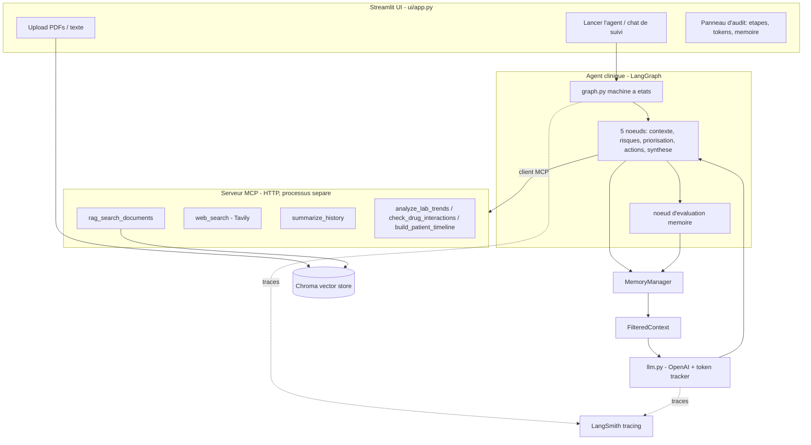

# dms-2 - Agent de Preparation Clinique et Coordination Sante

Agent unique orchestre par **LangGraph** qui ingere des dossiers patients
fragmentes, raisonne en **5 etapes cliniques explicites** avec memoire court /
long terme, appelle des outils specialises via un **serveur MCP HTTP autonome**
(RAG + recherche web + resume), est trace avec **LangSmith**, et est pilote
depuis une **interface Streamlit** qui audite chaque etape, le nombre de tokens
et chaque ecriture en memoire.

> Donnees synthetiques uniquement - usage de validation logicielle, non destine
> a un usage clinique reel.

## Architecture



Flux de donnees: Streamlit -> LangGraph -> outils du serveur MCP -> Agent ->
MemoryManager -> FilteredContext -> iteration de pensee LLM -> mise a jour memoire.

## Structure du projet

| Chemin | Role |
|--------|------|
| `config.py` | Variables d'environnement (OpenAI, MCP, Chroma, memoire, LangSmith). |
| `rag/vectorstore.py` | Collection Chroma persistante partagee + recherche cosine. |
| `rag/ingest.py` | Chargeurs PDF/DOCX/TXT + decoupage en chunks. |
| `mcp_server/server.py` | Serveur MCP FastMCP (HTTP) exposant tous les outils. |
| `mcp_server/tools/` | `rag.py`, `web_search.py`, `summarize.py`, `clinical.py`. |
| `memory/memory_manager.py` | Memoire court terme + long terme persistante + `evaluate_and_store`. |
| `memory/filtered_context.py` | Assemblage de contexte sous budget de tokens. |
| `agent/state.py` | Etat type de LangGraph (messages, etapes, outils, ledger de tokens). |
| `agent/llm.py` | Appels OpenAI (ChatOpenAI) avec capture de tokens par appel. |
| `agent/mcp_client.py` | Connexion au serveur MCP et adaptation des outils. |
| `agent/graph.py` | Noeuds des 5 etapes + noeuds d'evaluation memoire + cablage. |
| `agent/runtime.py` | Orchestration async pour l'UI. |
| `ui/app.py` | Interface Streamlit (upload, bienvenue, run, suivi, audit). |

## Les 5 etapes cliniques

A chaque etape, les outils MCP sont lies au modele (`ChatOpenAI.bind_tools`) et
l'agent decide **lui-meme** quels outils appeler (et avec quels arguments), de
maniere iterative (ReAct), pour creuser et enrichir le contexte issu de la
memoire avant de produire un resultat structure.

1. **Comprendre le contexte** - RAG sur les documents + timeline; conditions chroniques, medicaments, portrait longitudinal.
2. **Detecter les risques** - interactions medicamenteuses, controle insuffisant, suivi manquant, tendances de labos negatives.
3. **Prioriser** - urgent / peut attendre / a clarifier.
4. **Produire des actions** - questions au medecin, changements de comportement, examens a demander, rappels de suivi.
5. **Generer une synthese patient** - resume simplifie, vulgarise, multilingue.

Apres chaque etape, un **noeud d'evaluation memoire** decide si l'information va
en memoire court terme ou long terme (resumee via l'outil MCP `summarize_history`).

## Outils MCP exposes

`rag_search_documents`, `ingest_document`, `web_search_tool` (Tavily),
`summarize_history`, `analyze_lab_trends`, `check_drug_interactions`,
`build_patient_timeline`.

## Installation

> Python 3.12 ou 3.13 recommande. `chromadb` depend de `onnxruntime`, qui n'a
> pas encore de wheel pour Python 3.14. `init.sh` choisit automatiquement un
> interpreteur compatible si disponible.

```bash
cd dms-2
./init.sh                 # cree .venv, installe les dependances, copie .env
# editer .env : OPENAI_API_KEY (requis), TAVILY_API_KEY / LangSmith (optionnels)
source .venv/bin/activate
```

## Execution (deux processus)

```bash
# Terminal A - serveur MCP autonome
python -m mcp_server.server

# Terminal B - interface Streamlit
streamlit run ui/app.py
```

## Demo

1. Ouvrir l'UI -> bouton "Message de bienvenue de l'agent".
2. Barre laterale -> "Charger le patient exemple (docs/)" ou televerser des fichiers.
3. "Lancer l'agent (5 etapes)" -> l'agent execute les etapes et appelle les outils MCP.
4. Poser des questions de suivi dans le chat.
5. Le panneau d'audit montre chaque etape, les appels d'outils, l'etat memoire
   (court + long terme) et les tokens par etape et cumules.

## Observabilite

Definir dans `.env` : `LANGCHAIN_TRACING_V2=true`, `LANGCHAIN_API_KEY=...`,
`LANGCHAIN_PROJECT=dms-2-clinical-agent`. Chaque noeud LangGraph, appel LLM et
appel d'outil MCP cote client est alors trace automatiquement dans LangSmith.

## Notes

- Le store Chroma (`.chroma/`) est partage entre l'UI (ingestion) et le serveur
  MCP (recherche); les deux processus utilisent le meme modele d'embedding.
- La recherche web se degrade proprement si `TAVILY_API_KEY` est absent.
- Donnees synthetiques uniquement; ne pas utiliser pour des decisions cliniques reelles.
