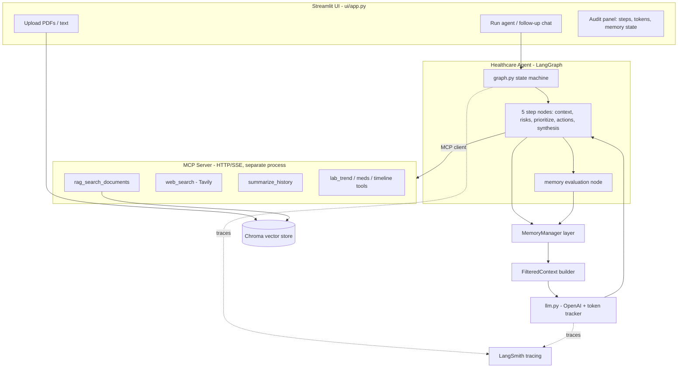

# dms-2 — Agent de Préparation Clinique et Coordination Santé

Target: `/Users/dmercier/Projects/8INF829/azure/dms-2` (currently empty, inside the `azure` git repo, sibling to the existing `dms` RAG project and the shared `docs/` synthetic patient charts).

## Confirmed decisions
- RAG vector store: in-process **Chroma** (fresh per session, zero infra, indexes user-uploaded PDFs/text at runtime).
- Observability: **LangSmith** (native LangGraph tracing of every node + token usage).
- MCP: a **standalone HTTP/SSE MCP server** process; the agent connects as an MCP client. Tools (RAG, web search, summarize, etc.) live behind the MCP boundary.
- LLM: **OpenAI** (reuse the `gpt-4o-mini` default + key handling pattern from `[dms/config.py](dms/config.py)`).
- Single agent only — no multi-agent. The agent itself sequences the 5 clinical steps and decides tool/memory usage.

## Architecture

Data flow matches the required architecture order: Streamlit -> LangGraph (LangChain) -> MCP Server tools -> Healthcare Agent -> MemoryManager -> FilteredContext -> LLM thought iteration -> Update Memory.

## Proposed project layout (`dms-2/`)
- `requirements.txt`, `.env.example`, `config.py` — env + OpenAI/LangSmith/Tavily keys (model from `[dms/config.py](dms/config.py)`).
- `mcp_server/server.py` — FastMCP HTTP/SSE server exposing all tools; run as its own process.
- `mcp_server/tools/` — `rag.py`, `web_search.py`, `summarize.py`, `clinical.py` (lab-trend / med-interaction / timeline helpers).
- `rag/vectorstore.py` + `rag/ingest.py` — Chroma collection, PDF/text loaders (reuse extraction ideas from `[dms/document_loader.py](dms/document_loader.py)`).
- `agent/state.py` — typed `AgentState` (messages, step, findings per step, memory snapshot, token ledger).
- `agent/graph.py` — LangGraph wiring of the 5 steps + tool loop + memory-eval node.
- `agent/nodes.py` — the 5 clinical step implementations + welcome node.
- `agent/llm.py` — OpenAI calls with per-call usage capture (prompt/completion/total tokens) attached to each step.
- `agent/mcp_client.py` — connects to the HTTP MCP server, adapts MCP tools into LangGraph tool calls.
- `memory/memory_manager.py` — **separate layer**: short-term buffer + long-term summarized store + `evaluate_and_store()`.
- `memory/filtered_context.py` — assembles/ranks short-term + long-term + RAG snippets into a token-budgeted context.
- `ui/app.py` — Streamlit front end (upload, welcome, run, follow-up, audit).
- `README.md` — setup + demo instructions (style modeled on `[dms/PLAN.md](dms/PLAN.md)`).

## Agent: 5-step thought process (LangGraph nodes)
Single ReAct-style agent that walks a fixed clinical pipeline, calling MCP tools as needed and surfacing reasoning to the UI:
1. **Comprendre le contexte** — RAG over uploaded docs + timeline tool; identify probable chronic diseases, build longitudinal portrait.
2. **Détecter les risques** — drug interactions, poorly controlled diabetes, missing follow-up, negative lab trends (lab-trend + web_search tools).
3. **Prioriser** — classify findings as urgent / can-wait / needs-clarification.
4. **Produire des actions** — questions for the physician, behavior changes, exams to request, follow-up reminders.
5. **Générer une synthèse patient** — simplified, multilingual, vulgarized summary.

After each step a **memory-evaluation node** decides whether new info goes to short-term or long-term memory (per spec).

## Memory layer (distinct module)
- **Short-term**: rolling window of the last N chat turns (conversation buffer), passed each turn.
- **Long-term**: summarized patient history built via the `summarize_history` MCP tool; persisted in a small store (JSON + optional Chroma collection) and retrieved by relevance.
- `MemoryManager.evaluate_and_store(step_output)` — heuristic + LLM check to route facts to short vs long term and trigger summarization. `FilteredContext` then composes the final prompt context within a token budget.

## MCP tools to expose (the "list of useful tools")
- `rag_search_documents` — semantic search over uploaded patient records (Chroma).
- `web_search` — Tavily for up-to-date guidelines / drug info (the RAG-web requirement).
- `summarize_history` — summarize a PDF/section into long-term-memory material.
- `analyze_lab_trends` — detect negative trends across longitudinal labs.
- `check_drug_interactions` — flag medication interactions (web_search-backed).
- `build_patient_timeline` — order events chronologically from fragmented docs.
- `ingest_document` — add an uploaded file to the Chroma index.

## Observability + token tracking
- Set `LANGCHAIN_TRACING_V2` / LangSmith project env; every node and tool call is auto-traced.
- `agent/llm.py` records prompt/completion/total tokens per call into the `AgentState` token ledger; the Streamlit audit panel shows per-step and cumulative token counts (mirrors the token-accounting style in `[dms/llm.py](dms/llm.py)`).

## Streamlit demo flow
1. Open UI -> friendly agent welcome message.
2. Upload PDFs / text files -> indexed into Chroma for RAG.
3. Click "Let the agent work" -> agent runs the 5 steps, may ask clarifying questions.
4. User asks follow-up questions and interacts.
5. Audit section shows every step, tool call, LLM message, memory state (short + long term), and token counts per step.

## Setup
- `requirements.txt`: `langgraph`, `langchain`, `langchain-openai`, `langchain-mcp-adapters`, `mcp`, `chromadb`, `openai`, `pypdf`, `tavily-python`, `langsmith`, `streamlit`, `python-dotenv`.
- Run order: start MCP server (`python -m mcp_server.server`), then `streamlit run ui/app.py`.

## Out of scope / notes
- Synthetic data only; not for clinical use (carry over the disclaimer from `[dms/PLAN.md](dms/PLAN.md)`).
- A small `init.sh` and `.env.example` will mirror the existing `dms` conventions.