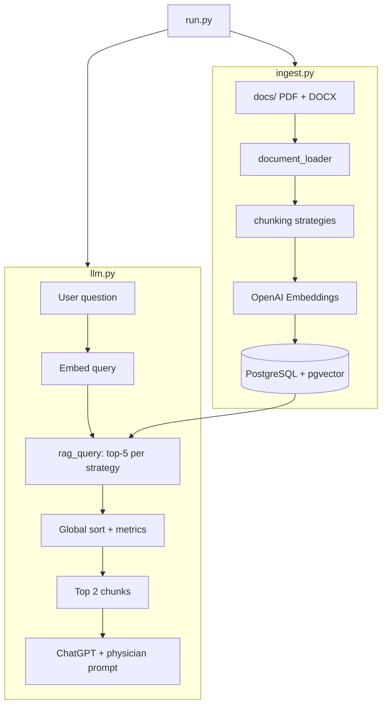

# DMS ù Local Healthcare RAG Agent

## Overview

A locally runnable Python RAG pipeline over synthetic patient records in `../docs`. Documents are chunked with four comparative strategies, embedded with OpenAI embedding models, stored in PostgreSQL + pgvector (Docker), and queried by an LLM agent acting as a professional healthcare physician.

## Architecture



## Components

| File | Role |
|------|------|
| `init.sh` | Create venv, install deps, start Docker Postgres/pgvector, wait for DB |
| `ingest.py` | Load docs, chunk (4 methods), embed, upsert vectors |
| `llm.py` | LLM init, `rag_query`, physician prompt, answer generation |
| `run.py` | End-to-end: ingest ? init LLM ? 4 test Q&A with metrics |
| `config.py` | Env vars, embedding model list, DB connection |
| `chunking.py` | paragraph, page, words_250, llm_optimized |
| `document_loader.py` | PDF/DOCX text extraction |
| `database.py` | Schema, pgvector search |
| `prompts.py` | Physician system prompt template |

## Chunking strategies (comparative)

1. **paragraph** ù Split on blank lines / paragraph boundaries.
2. **page** ù One chunk per PDF page (DOCX treated as single ùpageù sections by `---` or full doc).
3. **words_250** ù Fixed ~250-word windows with overlap.
4. **llm_optimized** ù Sentence-aware segments (~400 words) with 50-word overlap for retrieval quality.

Ingest logs per-file and per-method: chunk count, avg length, min/max words.

## Embedding engines (testing list)

Configured in `config.EMBEDDING_MODELS`:

- `text-embedding-3-small` (default ingest/query)
- `text-embedding-3-large`
- `text-embedding-ada-002`

Ingest stores vectors tagged with `embedding_model`. `run.py` uses the default model for retrieval; optional `INGEST_ALL_MODELS=1` embeds with all models for A/B comparison (slower, more API cost).

## Database

- Image: `pgvector/pgvector:pg16`
- Port: `5433` ? container `5432`
- DB: `dms_rag`, user/password: `dms`
- Table `document_chunks`: content, metadata, `chunk_method`, `embedding_model`, `embedding vector(1536)`

Similarity: cosine distance via pgvector (`<=>`); reported metric: `similarity = 1 - distance`.

## Per-question evaluation (3 sub-steps)

For each test question, `run.py` executes:

1. **RAG answer** ù Top-2 retrieved chunks injected into the physician prompt (`answer_with_rag`).
2. **Full-document answer** ù Entire `docs/` corpus concatenated into the same physician prompt (`answer_with_full_documents`).
3. **Judge LLM** ù Compares RAG vs full-chart answers given the RAG excerpts; returns JSON scores:
   - `accuracy_score`, `quality_score`, `thoroughness_score`, `global_accuracy_score` (0ù100)
   - Short assessments for quality, thoroughness, accuracy, and an overall summary

A **score matrix** is printed at the end (and saved in `last_run_report.json` under `score_matrix`), including judge scores plus Full-Chart token usage: absolute tokens, additional tokens vs RAG (absolute and %), and Full-Chart % of per-question total (RAG + Full-Chart + Judge).

## RAG query flow (`rag_query`)

1. Embed the search string with the active embedding model.
2. For each chunk method, retrieve **top 5** chunks (cosine similarity).
3. Merge candidates (up to 20), sort globally by similarity.
4. Attach metrics: `chunk_method`, `source_file`, `chunk_index`, `similarity`, `distance`, `embedding_model`, word count.
5. Select **top 2** chunks overall.
6. Inject into the physician prompt; call ChatGPT to answer.

## LLM

- Provider: OpenAI Chat Completions
- Env: `OPENAI_API_KEY`, optional `OPENAI_CHAT_MODEL` (default `gpt-4o-mini`)
- Role: board-certified physician synthesizing chart data; cites limitations; not a substitute for clinical judgment.

## Test questions (client chart)

Derived from AURALIS TEST PATIENT synthetic records:

1. **FNA / pathology** ù Interpretation of left cervical lymph node FNA and flow cytometry (2021).
2. **CT chest** ù Pulmonary nodule findings and surveillance recommendation (2022).
3. **Hematuria** ù Status of microscopic hematuria workup and urology surveillance plan.
4. **Lymphadenopathy follow-up** ù IM assessment and plan as of March 2025 (nodes, CRP, next steps).

## Execution

```bash
cd dms
export OPENAI_API_KEY=sk-...
./init.sh          # once: venv + Docker
source .venv/bin/activate
python run.py      # ingest + 4 Q&A + metrics
```

Or after init:

```bash
python ingest.py   # ingest only
python llm.py      # interactive / demo queries
python run.py      # full pipeline
```

## Metrics printed per run

- **Ingest**: chunks per method, embedding latency, tokens (if available), model used.
- **RAG**: per-candidate rank, similarity, distance, chunk_method, source file.
- **LLM**: model, prompt token estimate, latency, final answer.

## Dependencies

See `requirements.txt`: `openai`, `psycopg2-binary`, `pgvector`, `pypdf`, `python-docx`, `python-dotenv`.

## Security

- Never commit `.env` or API keys.
- Synthetic data only; outputs are for software validation, not clinical use.
