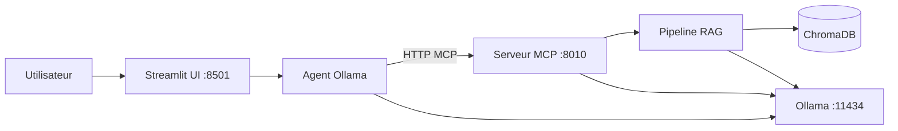
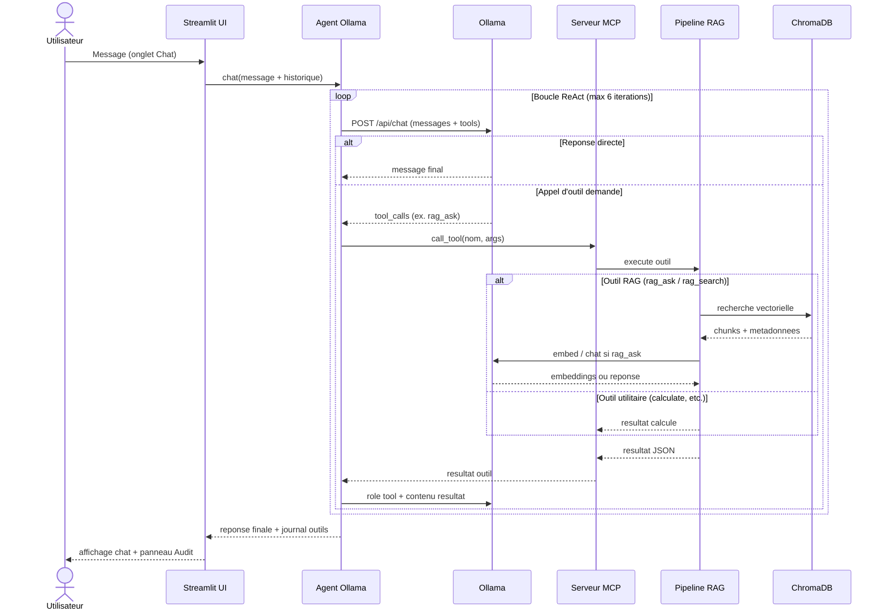

# Agent conversationnel nt-rag

Document de presentation du module agent ajoute au projet **nt-rag** : un assistant web capable de converser, d'interroger des documents medicaux indexes (RAG) et d'appeler des outils via le protocole **MCP** (Model Context Protocol).

---

## 1. Objectif

L'agent reutilise l'infrastructure RAG deja en place (`ingest.py`, `query.py`, Chroma, Ollama) sans la remplacer. Il ajoute :

- une **interface web** (Streamlit) pour discuter avec l'assistant ;
- un **serveur MCP** qui expose le RAG et des outils d'exemple comme des fonctions appelables ;
- un **agent ReAct** leger qui laisse Ollama decider quels outils invoquer.

Les pipelines CLI (`run.py ingest`, `ask`, `chat`, `eval`) restent disponibles pour les benchmarks et l'usage terminal.

---

## 2. Architecture



| Composant | Role | Port |
|-----------|------|------|
| **Ollama** | Embeddings (`nomic-embed-text`) + chat (`llama3.2`) | 11434 |
| **mcp-server** | Outils MCP (RAG, calcul, etc.) | 8010 |
| **ui** | Chat, indexation, upload de fichiers | 8501 |

Sous Docker Compose, le service `ollama-init` telecharge automatiquement les modeles au premier demarrage.

---

## 3. Structure du code

```
nt-rag/
  agent/
    chat_agent.py      # Boucle Ollama + appels d'outils MCP
    mcp_client.py      # Client HTTP MCP
    runtime.py         # Pont async pour Streamlit
  mcp_server/
    server.py          # Serveur FastMCP
    tools/
      rag.py           # Outils RAG (wrappers ingest/query)
      examples.py      # Outils utilitaires (calcul, heure, etc.)
  ui/
    app.py             # Interface web Streamlit
  ingest.py            # Pipeline d'indexation (partage)
  query.py             # Pipeline de question-reponse (partage)
  chunking.py          # Strategies de decoupe
  docker-compose.yml   # Ollama + MCP + UI
```

---

## 4. Fonctionnement de l'agent

1. L'utilisateur envoie un message dans l'onglet **Chat**.
2. L'agent envoie l'historique a **Ollama** avec la liste des outils MCP disponibles.
3. Ollama peut repondre directement ou demander l'appel d'un outil (`rag_ask`, `calculate`, etc.).
4. L'agent execute l'outil via le **client MCP**, renvoie le resultat a Ollama, et repete jusqu'a obtenir une reponse finale (max 6 iterations).
5. Le panneau **Audit** affiche les appels d'outils et leur latence.



La strategie de chunking active (sidebar) est transmise a l'agent pour orienter les requetes RAG vers la bonne collection Chroma.

---

## 5. Outils MCP exposes

### Outils RAG

| Outil | Description |
|-------|-------------|
| `rag_ask` | Pipeline complet : recherche semantique + generation de reponse |
| `rag_search` | Recherche seule (extraits + provenance, sans LLM) |
| `ingest_documents` | Indexe tous les PDF/DOCX de `docs/` |
| `ingest_file` | Indexe un fichier unique |
| `ingest_uploaded_files` | Indexe des fichiers televerses |
| `index_stats` | Nombre de chunks et liste des sources |
| `list_chunk_methods` | Liste les strategies de chunking |
| `list_document_sources` | Liste les fichiers disponibles dans `docs/` |

### Outils utilitaires

| Outil | Description | Exemple |
|-------|-------------|---------|
| `calculate` | Calcul arithmetique securise | `(30+1)*19` ? 589 |
| `get_current_time` | Heure UTC actuelle | ù |
| `count_words` | Compte les mots d'un texte | ù |
| `echo_message` | Echo (demonstration MCP) | ù |

Chaque outil RAG accepte un parametre `chunk_method` pour cibler la collection vectorielle adequate.

---

## 6. Strategies de chunking

Quatre methodes heritees du pipeline d'evaluation (`chunking.py`) :

| Methode | Principe |
|---------|----------|
| `fixed_chars` | Fenetres de caracteres (taille/chevauchement configurables) |
| `paragraph` | Decoupe aux sauts de paragraphe |
| `page` | Un chunk par page PDF (split si trop long) |
| `words_250` | Fenetres de 250 mots |

Chaque methode produit une **collection Chroma distincte** :

```
docs_rag_{chunk_method}_{embed_model}
```

Exemple : `docs_rag_fixed_chars_nomic-embed-text`

---

## 7. Interface web (Streamlit)

Trois onglets :

### Chat
- Conversation avec l'agent.
- Affiche la methode de chunking active.
- Panneau d'audit des appels MCP.

### Index & chunking
- Choix de la methode de decoupe.
- Bouton **Embed & index docs/** : chunk + embed + stockage Chroma.
- Vue d'ensemble des collections (nombre de chunks par methode).

### Add documents
- Upload de PDF/DOCX vers `uploads/`.
- Indexation dans la collection choisie.
- Re-indexation de fichiers deja televerses.

La **sidebar** affiche l'etat de connexion (Ollama, MCP), la methode active et les statistiques de l'index.

---

## 8. Demarrage

### Docker Compose (recommande)

```bash
cd nt-rag
docker compose up --build
```

| Service | URL |
|---------|-----|
| Interface web | http://localhost:8501 |
| Serveur MCP | http://localhost:8010/mcp |
| Ollama | http://localhost:11434 |

Premier lancement : `ollama-init` telecharge les modeles (quelques minutes).

Indexation initiale (optionnelle) :

```bash
docker compose exec mcp-server python -c "from ingest import run_ingest; run_ingest(clear=True)"
```

### Mode local (terminaux separes)

```bash
# Terminal 1
python -m mcp_server.server

# Terminal 2
streamlit run ui/app.py
```

Ollama doit tourner (`docker compose up -d ollama` ou `./init.sh`).

---

## 9. Configuration (.env)

| Variable | Defaut | Description |
|----------|--------|-------------|
| `OLLAMA_BASE_URL` | `http://localhost:11434` | API Ollama |
| `OLLAMA_EMBED_MODEL` | `nomic-embed-text` | Modele d'embedding |
| `OLLAMA_CHAT_MODEL` | `llama3.2` | Modele de chat |
| `MCP_HOST` / `MCP_PORT` | `127.0.0.1` / `8010` | Serveur MCP |
| `MCP_SERVER_URL` | `http://127.0.0.1:8010/mcp` | URL client MCP |
| `DOCS_DIR` | `../docs` | Documents source |
| `CHROMA_DIR` | `./data/chroma` | Index vectoriel |
| `UPLOADS_DIR` | `./uploads` | Fichiers televerses |

Sous Docker, ces variables sont surchargees dans `docker-compose.yml` (`http://ollama:11434`, etc.).

---

## 10. Relation avec le pipeline RAG existant

| Usage | Commande / acces |
|-------|----------------|
| Indexation CLI | `python run.py ingest` |
| Question unique | `python run.py ask "..."` |
| Chat terminal | `python run.py chat` |
| Benchmark eval | `python run.py eval` |
| Agent web + MCP | `docker compose up` ou Streamlit + MCP server |

L'agent **ne duplique pas** la logique metier : les outils MCP appellent directement `run_ingest`, `ask_with_metrics` et les fonctions Chroma existantes.

---

## 11. Exemple de session

**Utilisateur :** Quel suivi a ete recommande sur le CT thorax de 2022 ?

**Agent (via `rag_ask`) :** Recherche dans Chroma ? contexte des chunks pertinents ? reponse Ollama avec citation des fichiers sources.

**Utilisateur :** Combien font (30+1)*19 ?

**Agent (via `calculate`) :** `589`

**Utilisateur :** Quelle heure est-il ?

**Agent (via `get_current_time`) :** Heure UTC formatee.

---

## 12. Limites connues

- L'agent depend d'Ollama avec support des **tool calls** (llama3.2+).
- Les modeles doivent etre presentes dans le conteneur Ollama (sinon erreur 404 sur `/api/chat`).
- Chaque rerun Streamlit ouvre une session MCP courte (comportement normal, visible dans les logs).
- Donnees synthetiques uniquement ù ne pas utiliser avec de vrais dossiers patients en production.

---

## 13. Pistes d'evolution

- Ajouter des outils metier (timeline clinique, tendances labo, etc.).
- Persistance de l'historique de conversation.
- Tracing (LangSmith ou equivalent) pour auditer les decisions de l'agent.
- Support de formats supplementaires (TXT, Markdown) dans l'upload.
